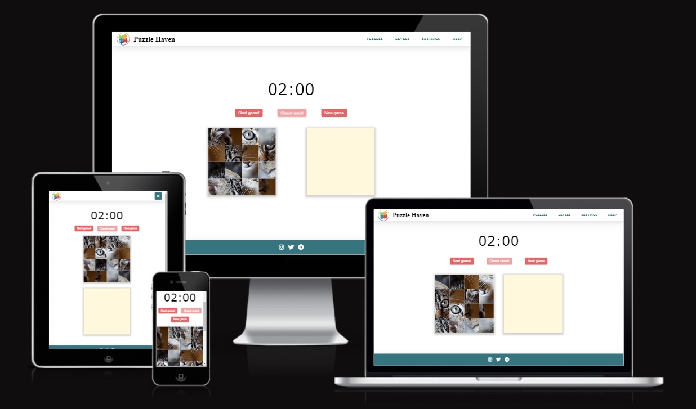
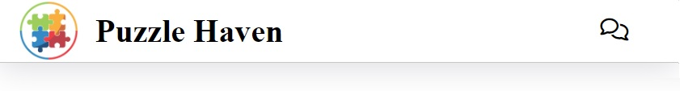
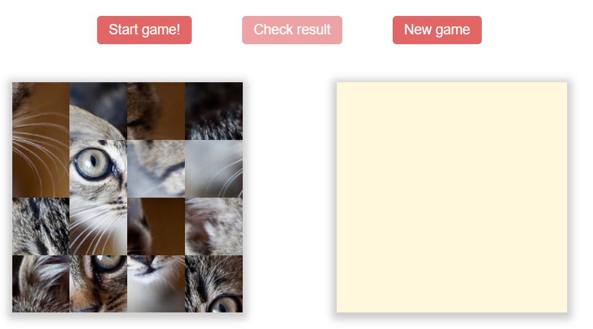
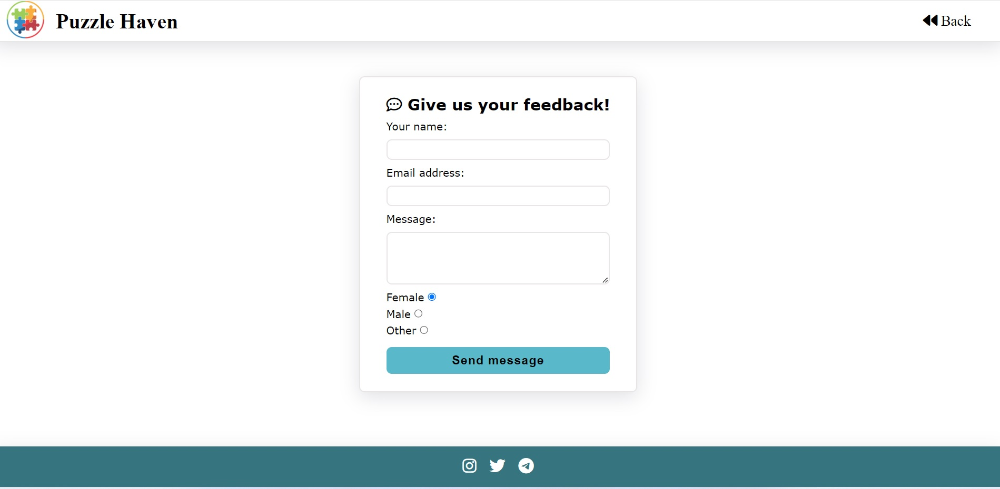

 ## Puzzle Haven 

Welcome to the Puzzle Haven Platform! There are millions of free Haven puzzles created by a large community. You can create, play, share puzzles and compete with other users.  

The live link can be found here - [Puzzle Game Platform](https://anestezia-zip.github.io/Puzzle-game/)

## Features 
Puzzle Game is an engaging interactive experience that challenges players with logical puzzles based on drag-and-drop mechanics.

### Header
Clicking on the logo will take you to the main page. By clicking on the comments icon in the right corner, the application will take you to a page where you can leave feedback and express your own opinion, wishes and other comments regarding our website.

### Main page
- __Start, Check, New Game Buttons:__  
The game provides players with the ability to initiate the game using the "Start" button, verify their solution with the "Check" button, and begin a new game session using the "New Game" button.

- __Interactive Puzzle Mechanic:__  
Players can interact with the puzzles by dragging and dropping pieces from the first block to the empty block below, creating an immersive and enjoyable gameplay experience.  

### Feedback page
The web application has a second page with a feedback form:

## Future features
### Footer
There are 3 external links in the footer in the form of Instagram, Twitter, Telegram icons:

- Instagram: Users will be able to follow the latest news, upcoming features and community interaction.

- Twitter: News about new puzzles, upcoming features, and discussions inside Twitter community.

- Telegram: An opportunity to join the Telegram channel to discuss puzzles, share ideas, and keep up to date with the development of the platform.

## Testing 
### Functionality Testing

I rigorously tested every feature and button to ensure they perform as expected. This included the following:

- Verifying that the Start, Check, and New Game buttons correctly initiate the appropriate actions.
- Ensuring that the puzzle blocks are randomly generated, not repeated, and positioned appropriately 
- Confirming that the pop-ups work correctly and work the appropriate logic
### Compatibility and Responsiveness
Our website was tested on various devices and browsers to ensure responsiveness and compatibility. We made sure that:

- The website functions seamlessly on different screen sizes, including desktops, tablets, and mobile devices.
- All buttons and interactive elements are easy to tap and use on touch devices.
- The website maintains its aesthetics and functionality across popular browsers.
- I tested that this page works in different browsers: Chrome, Firefox, Safari.
- Home page are all readable and easy to understand.
### User Interaction
It is important to close attention to user interactions to guarantee a user-friendly experience:

- Verified that the drag-and-drop puzzle mechanics work smoothly on both desktop and touch devices.
- Checked that buttons, links, and navigation are intuitive and easy to understand.

### Validator Testing 
- HTML
  - No errors were returned when passing through the official [W3C HTML validator](https://validator.w3.org/nu/?doc=https%3A%2F%2Fanestezia-zip.github.io%2FPuzzle-game%2F)
- CSS
  - No errors were found when passing through the official [W3C CSS validator](https://jigsaw.w3.org/css-validator/validator?uri=https%3A%2F%2Fanestezia-zip.github.io%2FPuzzle-game%2F&profile=css3svg&usermedium=all&warning=1&vextwarning=&lang=en)
- Javascript
  - No errors were returned when passing through the official [JSHINT validator](https://jshint.com/)

- Accessibility
    - I confirmed that the colors and fonts chosen are easy to read and accessible by running it through lighthouse in devtools  

## Languages&Tools Used

- HTML5
- CSS3
- jQuery

## Deployment 

- The site was deployed to GitHub pages. The steps to deploy are as follows: 
  - In the GitHub repository, navigate to the Settings tab 
  - From the source section drop-down menu, select the Main Branch
  - Once the main branch has been selected, the page will be automatically refreshed with a detailed ribbon display to indicate the successful deployment.
  
  The live link can be found here - [Puzzle Game Platform](https://anestezia-zip.github.io/Puzzle-game/)

## Credits 

- The icons in the footer were taken from [Font Awesome](https://fontawesome.com/)
- A dropdown toggleable menu is from this open Source site [w3schools.com](https://www.w3schools.com/howto/howto_js_dropdown.asp)