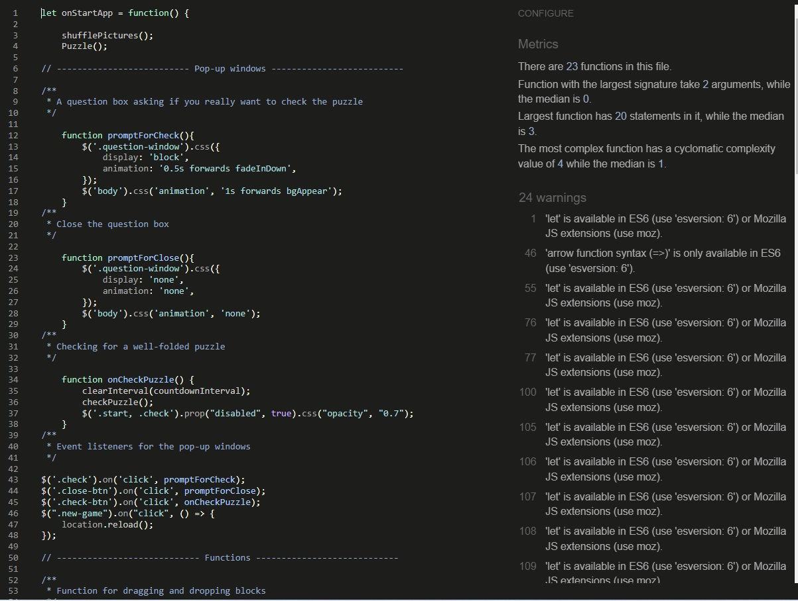

 ## Puzzle Haven 

Welcome to the Puzzle Haven Platform! There are millions of free Haven puzzles created by a large community. You can create, play, share puzzles and compete with other users.  

The live link can be found here - [Puzzle Game Platform](https://anestezia-zip.github.io/Puzzle-game/)

## Features 
Puzzle Game is an engaging interactive experience that challenges players with logical puzzles based on drag-and-drop mechanics.

- __Start, Check, New Game Buttons:__  
The game provides players with the ability to initiate the game using the "Start" button, verify their solution with the "Check" button, and begin a new game session using the "New Game" button.

- __Interactive Puzzle Mechanic:__  
Players can interact with the puzzles by dragging and dropping pieces from the first block to the empty block below, creating an immersive and enjoyable gameplay experience.  

## Future features
### Header
In the header, you will find four buttons that are planned to be implemented in the future, enhancing the user experience and providing a more comprehensive puzzle-solving adventure.  

- **Puzzles button:**  
The "Puzzles" button will grant users access to a diverse assortment of puzzle themes. Upon clicking, users will be directed to a page displaying a wide array of puzzles, each categorized by theme, difficulty level, and popularity. This feature will enable users to explore puzzles tailored to their preferences, making their puzzle-solving experience even more engaging and enjoyable.
- **Levels button:**  
Clicking the "Levels" button will lead users to a dedicated section where they can choose from various difficulty levels. This functionality aims to provide users with the opportunity to customize the challenge of their puzzles, catering to both beginners and experienced solvers.
- **Settings button:**  
 The "Settings" option will empower users to personalize their puzzle environment. Users can adjust sound settings to their liking, enhancing their immersion in the puzzle-solving process. Additionally, a selection of page themes will be available, allowing users to visually tailor their experience to their preferences.
- **Help button:**  
The "Help" button will offer valuable resources for users seeking assistance. This section will feature an in-depth FAQ section, addressing common queries and providing prompt solutions. For more individualized support, users will have the option to connect with the support team, allowing for specific inquiries and feedback sharing, contributing to the continual enhancement of the platform.
### Footer
There are 3 external links in the footer in the form of Instagram, Twitter, Telegram icons:

- Instagram: Users will be able to follow the latest news, upcoming features and community interaction.

- Twitter: News about new puzzles, upcoming features, and discussions inside Twitter community.

- Telegram: An opportunity to join the Telegram channel to discuss puzzles, share ideas, and keep up to date with the development of the platform.

## Testing 
### Functionality Testing

I rigorously tested every feature and button to ensure they perform as expected. This included the following:

- Verifying that the Start, Check, and New Game buttons correctly initiate the appropriate actions.
- Ensuring that the puzzle blocks are randomly generated, not repeated, and positioned appropriately 
- Confirming that the pop-ups work correctly and work the appropriate logic
### Compatibility and Responsiveness
Our website was tested on various devices and browsers to ensure responsiveness and compatibility. We made sure that:

- The website functions seamlessly on different screen sizes, including desktops, tablets, and mobile devices.
- All buttons and interactive elements are easy to tap and use on touch devices.
- The website maintains its aesthetics and functionality across popular browsers.
- I tested that this page works in different browsers: Chrome, Firefox, Safari.
- Home page are all readable and easy to understand.
### User Interaction
It is important to close attention to user interactions to guarantee a user-friendly experience:

- Verified that the drag-and-drop puzzle mechanics work smoothly on both desktop and touch devices.
- Checked that buttons, links, and navigation are intuitive and easy to understand.

### Validator Testing 
- HTML
  - No errors were returned when passing through the official [W3C HTML validator]()
- CSS
  - No errors were found when passing through the official [W3C CSS validator](https://jigsaw.w3.org/css-validator/validator?uri=https%3A%2F%2Fanestezia-zip.github.io%2FPuzzle-game%2F&profile=css3svg&usermedium=all&warning=1&vextwarning=&lang=en)
- Javascript
  - No errors were returned when passing through the official [JSHINT validator](https://jshint.com/)

- Accessibility
    - I confirmed that the colors and fonts chosen are easy to read and accessible by running it through lighthouse in devtools  

## Languages&Tools Used

- HTML5
- CSS3
- jQuery

## Deployment 

- The site was deployed to GitHub pages. The steps to deploy are as follows: 
  - In the GitHub repository, navigate to the Settings tab 
  - From the source section drop-down menu, select the Main Branch
  - Once the main branch has been selected, the page will be automatically refreshed with a detailed ribbon display to indicate the successful deployment.
  
  The live link can be found here - [Puzzle Game Platform](https://anestezia-zip.github.io/Puzzle-game/)

## Credits 

- The icons in the footer were taken from [Font Awesome](https://fontawesome.com/)
- A dropdown toggleable menu is from this open Source site [w3schools.com](https://www.w3schools.com/howto/howto_js_dropdown.asp)